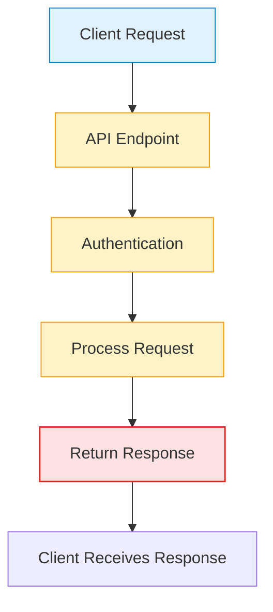

# API Design Guide

## 1. Introduction

This document specifies the design of the API, including endpoints, data models, and authentication mechanisms.

## 2. Authentication

The API will use [Specify authentication method, e.g., OAuth 2.0, API Keys].

## 3. Endpoints

### 3.1. Resource: /users

*   **GET /users:** Retrieves a list of users.
*   **POST /users:** Creates a new user.
*   **GET /users/{id}:** Retrieves a specific user.
*   **PUT /users/{id}:** Updates a specific user.
*   **DELETE /users/{id}:** Deletes a specific user.

## 4. Data Models

### 4.1. User

```json
{
  "id": "string",
  "username": "string",
  "email": "string",
  "created_at": "datetime"
}
```

## 5. Error Handling

The API will use standard HTTP status codes to indicate the success or failure of a request. The response body for an error will be in the following format:

```json
{
  "error": {
    "code": "integer",
    "message": "string"
  }
}
```

## 6. Happy Flow

